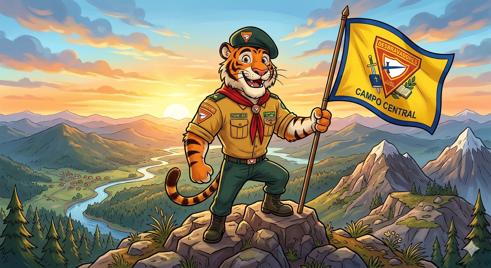

  
  
   
  

<h1>Desbravadores - Apoio ao Clube Tigre da Montanha</h1>

Esta organização foi criada para desenvolver soluções tecnológicas em apoio ao <b>Clube de Desbravadores Tigre da Montanha</b>. Nosso objetivo é facilitar a gestão do clube, ajudando líderes e membros na organização de suas tarefas, requisitos e atividades diárias.

### 🎯 O Objetivo
O projeto nasce da necessidade de digitalizar e otimizar a administração do clube. Queremos substituir processos manuais por uma plataforma centralizada que permita:
* **Gestão de Tarefas:** Organização clara de atividades por unidades ou classes.
* **Acompanhamento de Requisitos:** Facilidade para líderes monitorarem o progresso dos desbravadores em suas especialidades e classes regulares.
* **Planejamento de Eventos:** Cronograma de acampamentos, reuniões e atividades sociais.
* **Comunicação Eficiente:** Um ponto central para consulta de informações importantes do clube.

### 💡 A Solução
Estamos desenvolvendo uma aplicação voltada para a gestão de fluxo de trabalho, permitindo que o beneficiário (o Clube Tigre da Montanha) tenha uma visão clara do progresso de suas metas anuais e do desenvolvimento de cada desbravador.

### 🗂️ Estrutura da Organização
* 📂 **[Tigre-Banco-De-Dados](https://github.com/desbravadores-sisa)**: Modelagem relacional para armazenar membros, tarefas e progresso.
* 📂 **[Tigre-Backend-Java](https://github.com/desbravadores-sisa)**: API desenvolvida com Spring Boot para gerenciar a lógica de negócio e segurança.
* 📂 **[Tigre-Frontend-Web](https://github.com/desbravadores-sisa)**: Interface intuitiva para que os líderes e desbravadores interajam com o sistema.
* 📂 **[Tigre-Documentacao](https://github.com/desbravadores-sisa)**: Levantamento de requisitos e guias de uso para o clube.

### ⚙️ Tecnologias Principais

### ✒️ Equipe de Desenvolvimento
* **Integrante 1:** ARTHUR FELIPE AMARAL DA SILVA
* **Integrante 2:** GABRIEL CAMARGO BRAZ DE ALMEIDA
* **Integrante 3:** GABRIELLY MARQUEZ SARZURI
* **Integrante 4:** MARCELA BASTOS VICENTE
* **Integrante 5:** MATHEUS CHIOSINI SCALABRIN
* **Integrante 6:** NATHAN BARBOSA TEIXEIRA

---
*Este projeto é uma iniciativa voluntária para fortalecer o trabalho do Clube de Desbravadores Tigre da Montanha através da tecnologia.*
